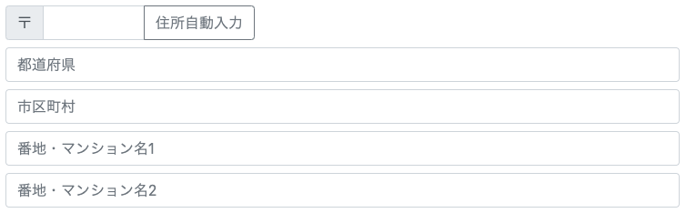

# rjsf-zipcode-address-jp

Custom widget for [react-jsonschema-form](https://github.com/rjsf-team/react-jsonschema-form).  
Input fields for Japanese zipcode and address.  
This has a function to search for an address from the entered zipcode and automatically enter it.  
Using [zipcloud API](http://zipcloud.ibsnet.co.jp/doc/api).

## License

[BSD 3-Clause License](./LICENSE).  
and see [郵便番号検索API利用規約 - zipcloud](http://zipcloud.ibsnet.co.jp/rule/api)

## Install

`npm install rjsf-zipcode-address-jp`

## Usage

```tsx
import Form from '@rjsf/core';
import { ZipcodeAddressJp } from 'rjsf-zipcode-address-jp';

<Form
  schema={{
    type: 'object',
    properties: {
      address: {
        title: '住所',
        type: 'string'
      }
    }
  }}
  widgets={{
    zipcodeAddress: ZipcodeAddressJp
  }}
  uiSchema={{
    address: {
      'ui:widget': 'zipcodeAddress'
    }
  }}
/>
```

## Screen shot



## Example

https://shatee.github.io/rjsf-widget-zipcode-address-jp/

